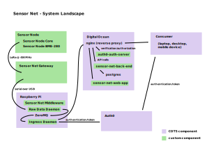

# Sensor Net
A sensor network for the home.

## High-level architecture
The currently used architecture is made up of five parts:
  * Sensor nodes
  * Gateway
  * Middleware
  * Back end
  * Front end (SPA)



## Sensor Nodes
The sensor nodes are split into two modules: the controller including the radio and the sensor itself.

### Controller
Details about the controller can be found in a separate [repository](https://github.com/hannes-hochreiner/sensor-node-core).

### Sensors
There are two sensors breakout boards that are designed to work with the available controller:
  * [Temperature, humidity, and pressure sensor (BME-280)](https://github.com/hannes-hochreiner/sensor-node-bme280)
  * [Acceleration and magnetometer (LSM303AGR)](https://github.com/hannes-hochreiner/sensor-node-lsm303agr)

## Gateway
For the gateway two different options have been explored:
  * a simple USB device that communicates with the host using a custom driver
  * using a single-board-computer to directly talk to the receiving module

### USB device
The [first iteration](https://github.com/hannes-hochreiner/ism-gateway) used an STM32 with a built-in USB interface.
It worked fine, but it was unstable.
After playing around with different options and versions of the STM HAL library, I concluded that it would be easier to have a dedicated chip for the USB interface.

In the [second iteration](https://github.com/hannes-hochreiner/sensor-net-gateway), I used an FTDI USB to UART bridge chip.
The gateway receives the messages from the sensor node, adds the RSSI and outputs them over USB (UART) as JSON strings.

```JSON
{
  "type":"rfm",
  "rssi":"-74",
  "data":"<encrypted message from sensor>"
}
```
### SBC
In a first iteration, the SBC implementation was implemented using a RaspberryPi Zero W and an RFM98 break-out.
The code to interface with the RFM98 can be found in a separate [repository](https://github.com/hannes-hochreiner/rfm98-breakout).

## Middleware
The middleware consist of a simple ZeroMQ queue to which the data from the sensors are published as JSON documents.
An agent subscribes to the queue and puts the messages into the repository.

The first iteration of the middleware can be found in a separate [repository](https://github.com/hannes-hochreiner/raw-data-db-agent).

In the [second iteration](https://github.com/hannes-hochreiner/sensor-net-middleware), is a re-implementation based on the second iteration of the USB gateway.

## Repository
The repository was implemented as a PostgreSQL database.
The schema can be found in the [middleware repository](https://github.com/hannes-hochreiner/raw-data-db-agent).

## Front-end
The front-end was split into a [REST service for serving the data](https://github.com/hannes-hochreiner/sensor-net-data-api) and a [web application](https://github.com/hannes-hochreiner/sensor-net-web-app) for the visualization.
